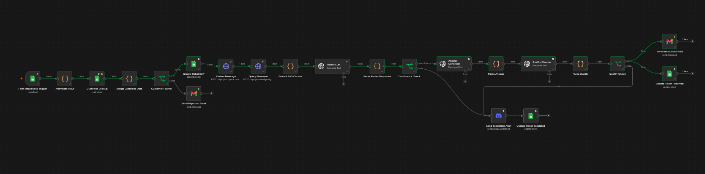
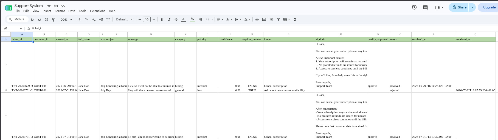
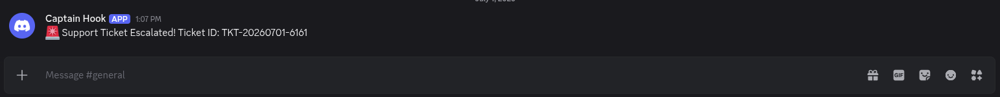
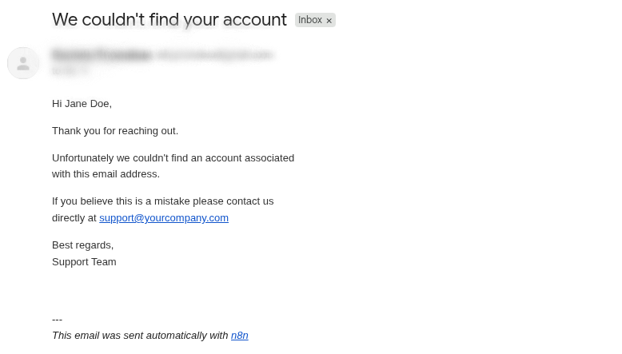
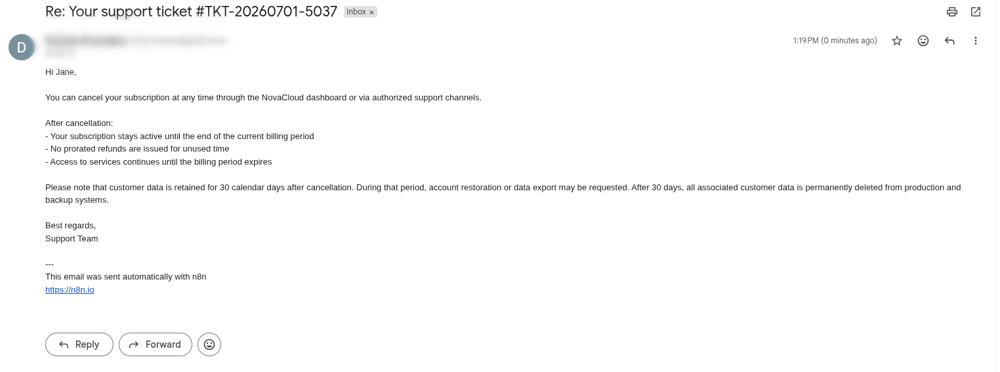

# AI Customer Support Agent

Combines retrieval-augmented generation (RAG), structured LLM reasoning, and automated quality control to handle customer support at scale — with human escalation as a fallback.

Watches for new Google Form submissions, validates the customer against the customers Google Sheet, retrieves relevant knowledge base context from Pinecone, classifies the ticket using an LLM router, generates and quality-checks a draft reply, then either sends an automated response or escalates to a human agent via Discord.

## Flow Summary

| Node | Description |
|------|-------------|
| Form Responses Trigger | Watches the Form Responses tab in Google Sheets for new submissions |
| Normalize Input | Cleans fields and generates a unique ticket ID in TKT-YYYYMMDD-XXXX format |
| Customer Lookup | Searches the customers sheet by email address |
| Merge Customer Data | Combines ticket data with the matched customer profile |
| Customer Found? | IF branch — unknown emails are rejected |
| Send Rejection Email | Sends a Gmail reply informing the submitter that no account was found |
| Create Ticket Row | Writes an initial row to the Tickets sheet with status = open |
| Embed Message | Generates an embedding for the customer message using OpenAI text-embedding-3-large |
| Prepare Pinecone Query | Code node — extracts the embedding array for the Pinecone request |
| Query Pinecone | HTTP Request — retrieves the top 5 semantically similar knowledge base chunks |
| Extract RAG Chunks | Code node — joins chunk texts and merges the full data object |
| Router LLM | GPT-5.4-mini — classifies the ticket and returns category, priority, confidence, requires_human, and intent |
| Parse Router Response | Code node — flattens the router output |
| Confidence Check | IF branch — routes to answer generation if confidence ≥ 0.65 AND requires_human = false, otherwise escalates |
| Answer Generator | GPT-5.4-mini — generates a professional draft reply using the message, customer profile, and RAG context |
| Parse Answer | Code node — extracts the answer |
| Quality Checker | GPT-5.4-mini — reviews the draft reply and returns approved true or false |
| Parse Quality | Code node — extracts quality result |
| Quality Check | IF branch — routes to auto-resolve if approved, otherwise escalates |
| Send Resolution Email | Gmail — sends the approved AI draft to the customer |
| Update Ticket Resolved | Updates the Tickets row with status = resolved |
| Send Escalation Alert |  Sends an alert to a Discord channel via webhook with the escalated Ticket ID |
| Update Ticket Escalated | Updates the Tickets row with status = rejected |

## Required Credentials

- Google Sheets OAuth2
- Google Drive OAuth2
- OpenAI API Key
- Pinecone API Key
- Gmail OAuth2
- Discord Webhook URL

## Setup

1. Create a Google Form with four fields: Full Name, Email, Subject, Message.
2. Link the form to a Google Sheet with two tabs: Form Responses and Tickets.
3. Create a separate Google Sheet for the customer database with customer records.
4. Configure the Form Responses Trigger to watch the Form Responses tab.
5. Set the customer database Sheet ID in the Customer Lookup node.
6. Configure OpenAI credentials and set the Pinecone index and namespace.
7. Configure Gmail credentials and set the rejection email sender address.
8. Configure a Discord webhook URL and set it in the Send Escalation Alert node.
9. Submit a test form entry to verify the full flow end to end.

## Ticket Classification

The Router LLM returns the following fields for every ticket:

| Field | Values |
|-------|--------|
| category | billing, technical, account, general |
| priority | low, medium, high |
| confidence | float 0–1 |
| requires_human | true / false |
| intent | short description of what the customer wants |

## Escalation Logic

A ticket is escalated when either condition is true:
- Confidence score is below 0.65
- requires_human is true (regardless of confidence)

All other tickets are auto-resolved with an AI-generated reply.

## Data Flow

For every submission the workflow produces:
- Ticket ID (TKT-YYYYMMDD-XXXX format)
- Category, Priority, Intent
- Confidence Score
- AI Draft Answer
- Final Status (open → resolved or escalated)

## Screenshots

  
  
  
  

