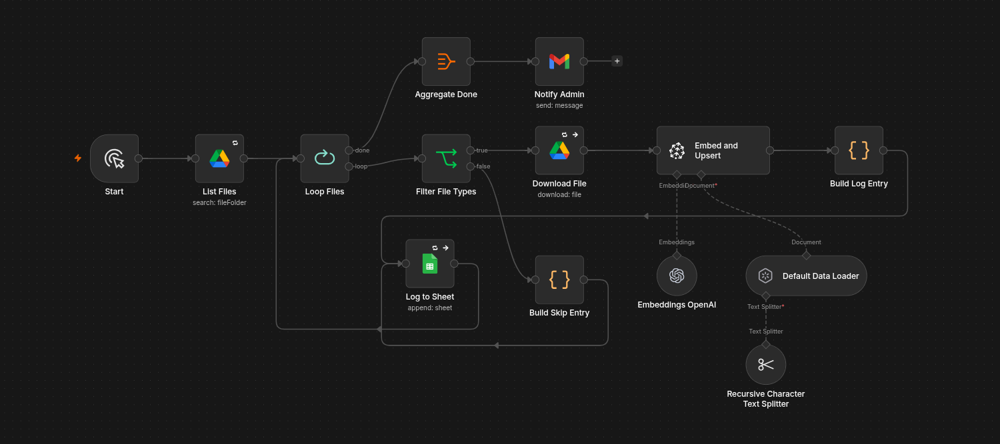

# Knowledge Ingestion System

Scans a Google Drive folder, extracts text from supported files, creates OpenAI embeddings, and stores them in Pinecone. Every processed file is logged to Google Sheets as `success`, `skipped`, or `error`. When the ingestion run completes, an email notification is sent to the configured administrator.

---

## Flow Summary

| Node                              | Description                                                   |
| --------------------------------- | ------------------------------------------------------------- |
| Start                             | Manual trigger                                                |
| List Files                        | Lists all files in the configured Google Drive folder         |
| Loop Files                        | Iterates through each file                                    |
| Filter File Types                 | Allows PDF, TXT and Markdown files; skips unsupported formats |
| Download File                     | Downloads file content from Google Drive                      |
| Default Data Loader               | Extracts document content and metadata                        |
| Recursive Character Text Splitter | Splits documents into chunks                                  |
| Embeddings OpenAI                 | Generates embeddings using OpenAI                             |
| Embed and Upsert                  | Stores vectors in Pinecone                                    |
| Build Log Entry                   | Creates success/error log records                             |
| Build Skip Entry                  | Creates log records for skipped files                         |
| Log to Sheet                      | Appends ingestion results to Google Sheets                    |
| Aggregate Done                    | Aggregates loop completion into a single item                 |
| Notify Admin                      | Sends completion email                                        |

---

## Supported File Types

* PDF (`application/pdf`)
* Plain Text (`text/plain`)
* Markdown (`text/markdown`)

All other file types are skipped and logged.

---

## Required Credentials

* Google Drive OAuth2
* Google Sheets OAuth2
* OpenAI API Key
* Pinecone API Key
* Gmail OAuth2

---

## Setup

1. Configure Google Drive credentials.
2. Set the target Google Drive folder ID in **List Files**.
3. Configure OpenAI credentials.
4. Configure Pinecone credentials and select your target index.
5. Create a Google Sheet for ingestion logs and configure **Log to Sheet**.
6. Configure Gmail credentials and set the notification email address in **Notify Admin**.
7. Run the workflow manually using **Start**.

---

## Output

For every processed file, the workflow records:

* File ID
* File Name
* Chunk Count
* Status (`success`, `skipped`, `error`)
* Ingestion Timestamp
* Error Message (if applicable)